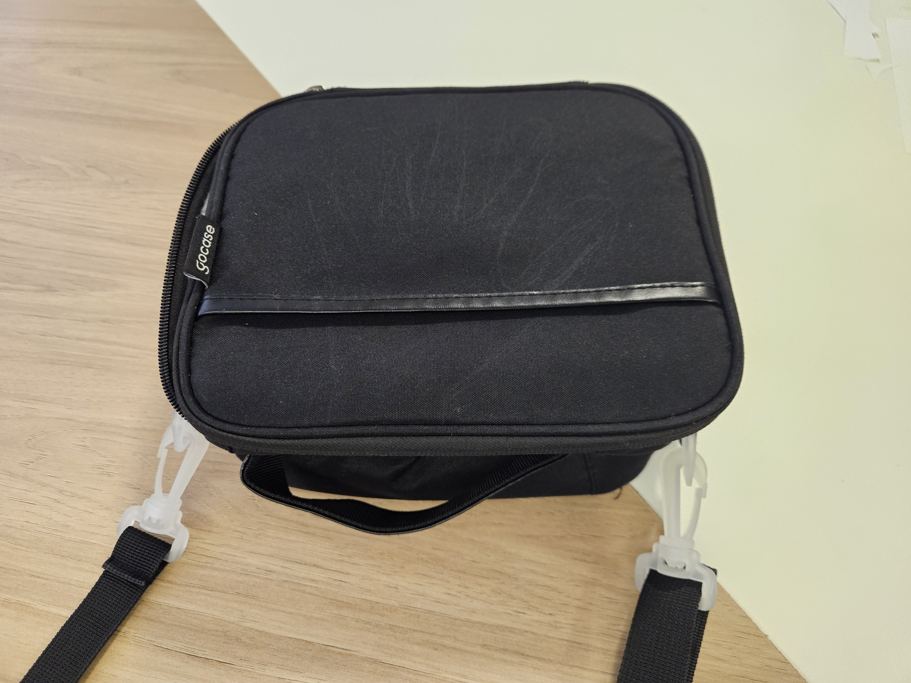
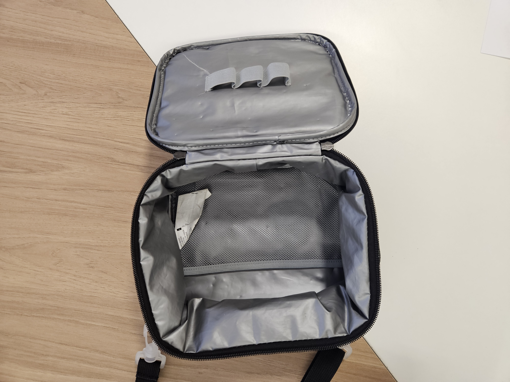
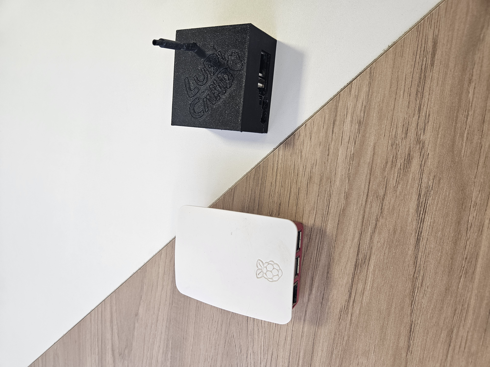

# Lancheira CyberDeck

Após ver alguns vídeos sobre CyberDeck Girl pensei em dividir com minha filha a ideia.

Partimos do case, que será a lancheira que minha filha gosta de carregar com ela.

A lancheira é um objeto de segurança para ela e já foi motivo de bullying na escola.
Nosso objetivo é mudar a percepção sobre o objeto, transformando em algo legal para todos que olharem.

Também inclui no projeto minha outra filha com o projeto de uma maleta de maquiagem.

Aqui vou tentar criar um diário anotando etapas e influencias.

## Videos

### Primeiro contato

Ao ver esses videos sobre o assunto pensei em iniciar esse projeto

[BR
O ESPECTRO DOS CYBERDECKS DE MENINA | Tecnologia e Classe ](https://www.youtube.com/watch?v=YSJjL3iizDE)

[BR
REAGINDO A PROJETOS DE GIRL CYBERDECKS | Tecnologia e Classe](https://www.youtube.com/watch?v=i1yylYJwd7Q)

### Uma versão de menina para menina:

Procurei um video que poderia mostrar para minha filhas e incentivasse elas a gostarem do assunto.


[gio yaml | tech & cyberdeck 👩‍💻](https://www.instagram.com/reel/DYPcHZcSTma/)

## Decisões iniciais

### A Lancheira

 
 

A lancheira tem aproximadamente:

 - 175mm Profundidade
 - 205mm Largura
 - 100mm Altura
 - 35mm Raio na borda

### Computador

 

Nós tínhamos 2 mini-computadores para escolher:

- RapsbarryPi 3B
- [OrangePi Zero3](http://www.orangepi.org/html/hardWare/computerAndMicrocontrollers/details/Orange-Pi-Zero-3.html)

No dia que fui iniciar o projeto a OrangePi estava ligada e com sistema [Armbian com Xfce](https://armbian.com/pt/boards/orangepizero3) funcionando, podendo ser explorada de imediato. Então foi nossa escolha.

### Baterias 18650


Eu tinha umas baterias de notebooks antigos então desmontamos e juntamos com as baterias que tínhamos de um projeto de robótica. São todas 18650.
Colocamos para carregar as baterias para separar as boas das ruins usado um multímetro.
Todas as baterias são de lítio trabalham de 4.2v a 3v nominal 3.7v

#### Organização das baterias

Preciso da saída de 5V para alimentar a tela e monitor.

Para isso teríamos 2 opções:
- Usar módulos USB que tem pouca potencia em 5v.
- Usar conversor direto para 5v.

As baterias podem ser ligadas em:
- Serie para somar tensão (Volts)
- Paralelo para somar corrente (Amperes)

Nos mercados vc vai encontrar a sigla S2 para dizer que tem 2 baterias em série e S3 para dizer que tem 3 baterias em série assim sucessivamente. E estranhamente S1 para dizer que não tem baterias em série, afinal 1 bateria só não ta em Série com nada.
A mesma logia a sigla P para paralelo.

```
W  = V x A

Watts - potencia
Vols - tensão
Amperes - corrente
```

Atualizações:
Infelizmente nosso pack vai ficar incompleto, e misturar baterias diferentes não é uma boa, vamos avaliar o que fazer.

##### 3-4.2V(1S)

A carga, o que vai ser alimentado, o PC, precisaria de um circuito elevador "step-up" para passar 3V-4.2V para 5V
Para o carregador, fonte, preciso ser de exatamente 4.2V ou um circuito "step-down".
Quanto menor a tensão maior a corrente. Quanto maior a corrente maior o desgaste das baterias.

CI para step-up
- Tps61088 - Operar com tensão minima de 2.7V e até 10A (chaveamento) / 5A (saída prática).
- 🚫 MT3608 - Operar com tensão mínima de 2.0V e até 4A (chaveamento)/ ~1.5A (saída prática) o que é baixo pois é solicitado 3A.
- 🚫 Xl6009 - Opera com tensão minima de 3.6V conferido no datasheet, apesar de vendedores dizerem diferente.


##### 6-8.4V(2S)

Usando 2 baterias em série para somar a tensão é necessário usar um "step-down" conversor DC-DC que vai regular da tensão maior para a tensão menor.

Olhando os modelos de "step-down" eles normalmente precisam de uma diferença minima de tensão entre entrada e saída para manter a regulação funcionando bem alguns dizem 2v outros 1.5v. Se eu achasse um com 1V ainda acharia que estou trabalhando muito no limite. E tem BMS que só corta alimentação com 2.5V o que daria 5V de saída, sem diferença.

Poderia usar um conversor buck-boost (abaixa e levanta)

- [SC8701](https://pt.aliexpress.com/item/1005006174233056.html) 95% 6A, R$62,19 com parafusos

##### 9-12.6V(3S)

Nesta configuração trabalho com no mínimo do mínimo 7.5v.
Sendo 2.5V de diferença dos 5V que preciso, uma distancia segura para os step-down funcionar.

- [SC8701](https://pt.aliexpress.com/item/1005006174233056.html) 95% 6A, R$62,19 com parafusos

- [MP1584EN](https://pt.aliexpress.com/item/1005012144215392.html) - 96% 3A R$9,50

- [LM25116](https://pt.aliexpress.com/item/1005004280783154.html) 95,5%, 8A, R$71,19 Necessário mais que 3V

- [XL6019](https://pt.aliexpress.com/item/1005007129565662.html) 94% 2.5A R$9,89
- XL6009 - obsoleto

Para carregar os celulares pretendo reaproveitar os carregadores do carro não sei como eles vão trabalhar com 9V.

##### 12-16.8V(4S) - 15-21(5S) - 18-25,2V(6S) 21-29.4V(7S)

[Módulo de carga rápida PD65W, interface USB tipo C, compatível com PD3.1 QC3.0 SCP PPS, carregador rápido 5V 9V 12V 20V](https://pt.aliexpress.com/item/1005008995629645.html)

Use essa configurações caso queira a saída de tensão para carregar equipamentos usando esse modulo, ele não eleva a tensão então para saída de 20V precisa ter mais de 20V.

### Teclado


Achamos esse teclado nas nossas coisas, mas a bateria estufou o preço da bateria é o preço do teclado, mas ele funcionou sem bateria ligado direto na usb. Achamos que vai dar certo.

### Tela 7"


Nós medimos o espaço e concluímos que a tela de 10" não iria caber. Então encomendamos uma menor no Aliexpress.
Tivemos que tomar algumas decisões e aprendemos algumas coisas:

- Telas IPS / TN 
- Touch
- Som

**Som** não pensamos em usar, então tudo bem a maioria das telas não vem com alto-falantes e a Orange Pi já possui saída para fones de ouvido.

**Touch** não era necessário, mas a diferença de preço era pequena que preferi deixar a opção aberta e comprei o modelo com toque integrado.

**TN/IPS** Acho que cometi um erro. Escolhi a **IPS** porque o custo estava menor e o anúncio destacava apenas vantagens, como o ângulo de visão lateral. Mas a **TN** tem uma vantagem que pra nós seria importante o baixo **consumo de energia**. Como o anúncio não descrevia essa característica, não sei o tamanho real dessa diferença no consumo.
